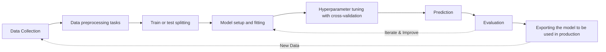

# Learning

This folder contains learning materials, tutorials, and practice notebooks for machine learning concepts.

## Contents

- Jupyter notebooks for hands-on practice
- Code examples and experiments
- Notes and documentation

## Getting Started

Make sure you have set up your environment following the instructions in the [main README](../README.md).

To create a new notebook in this folder:
1. Navigate to this directory in your terminal
2. Activate your virtual environment
3. Launch Jupyter Notebook or JupyterLab

```bash
cd Learning
jupyter notebook
```

## Topics

### Machine Learning Pipeline

A typical machine learning pipeline workflow implemented in scikit-learn, showing the complete process from data collection to production deployment.



---

### Supervised Learning

Supervised learning is a type of machine learning where the algorithm learns from labeled training data. The model learns to map inputs to outputs based on example input-output pairs. The goal is to learn a general rule that maps inputs to outputs, which can then be used to make predictions on new, unseen data.

**Key Characteristics:**
- Requires labeled training data (input-output pairs)
- Model learns from examples and feedback
- Goal is to predict outputs for new inputs
- Performance can be measured using test data

**Common Applications:**
- Classification (predicting categories)
- Regression (predicting continuous values)
- Spam detection
- Image recognition
- Price prediction

---

### Regression Analysis

Regression analysis is a supervised learning technique used to predict continuous numerical values. It models the relationship between a dependent variable (target) and one or more independent variables (features). The goal is to find the best-fitting mathematical function that describes this relationship.

**Types of Regression:**

**1. Linear Regression**
- Simple Linear Regression: One independent variable → [Hands-on Tutorial](simple_linear_regression.ipynb)
- Multiple Linear Regression: Multiple independent variables
- Assumes a linear relationship between variables
- Formula: y = mx + b (for simple linear regression)

**2. Polynomial Regression**
- Fits a polynomial curve to the data
- Useful when relationships are non-linear
- Can model complex patterns

**3. Ridge and Lasso Regression**
- Regularization techniques to prevent overfitting
- Ridge (L2): Reduces coefficient magnitudes
- Lasso (L1): Can eliminate features by setting coefficients to zero

**Common Use Cases:**
- House price prediction
- Stock market forecasting
- Sales forecasting
- Temperature prediction
- Customer lifetime value estimation

**Key Metrics for Evaluation:**
- Mean Squared Error (MSE)
- Root Mean Squared Error (RMSE)
- Mean Absolute Error (MAE)
- R-squared (R²) score

**Example in scikit-learn:**
```python
from sklearn.linear_model import LinearRegression
from sklearn.model_selection import train_test_split

# Split data
X_train, X_test, y_train, y_test = train_test_split(X, y, test_size=0.2)

# Create and train model
model = LinearRegression()
model.fit(X_train, y_train)

# Make predictions
predictions = model.predict(X_test)

# Evaluate
from sklearn.metrics import mean_squared_error, r2_score
mse = mean_squared_error(y_test, predictions)
r2 = r2_score(y_test, predictions)
```

---

## Jupyter Notebooks

Hands-on practice notebooks for machine learning concepts:

### Regression
- [Simple Linear Regression Tutorial](simple_linear_regression.ipynb) - Complete guide to implementing and evaluating linear regression models with scikit-learn

---

Add your learning topics and notebooks here as you progress through your machine learning journey.
